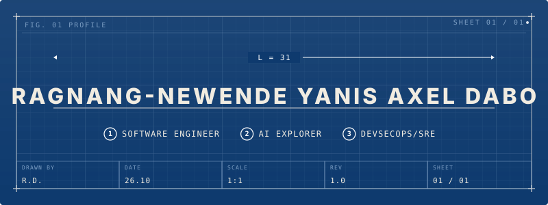

<div align="center">

</div>


<div align="center">
  
</div>

<br/>

---

## Who I am

```yaml
name:      "Tougouma Rakiswend Irvane Threvis"
alias:     ">_viscoot"
code:      "viscott" 
base:      "Ouagadougou, Burkina Faso"
mission:   "Learn & Build to Serve"

trajectory: >
  Software Engineer who designs systems,learns to builds them right,
  ships software applications, keeps them alive and reliable while driving their evolution.

philosophy: >
  "Code is a liability. Logic is an asset.
   Design before you code. Think before you write."

convictions:
  - "A requirement not verified is a bug waiting to be born"
  - "Clean code is a love letter to your future self and teammates"
  - "Build systems that can handle your success"

status:    "Stepping up. Shipping serious stuff."
```

---

## What I build with

<div align="center">


</div>

---

## Current Active work

| Project | What it is | Stack |
|---|---|---|
| **[ImmoFaso](https://github.com/irvane-threvis/immofaso)** | Real estate platform for Burkina Faso, PHP/MVC architecture | PHP · MVC · MySQL |
| **[TengLaafi (clone)](https://github.com/irvane-threvis/tenglaafi)** | RAG medical assistant rebuilt step by step — health corpus, indexing, API | Python · FastAPI · ChromaDB |
| **Banque Coris — internal platform** | Internal innovation tool, SPA with admin dashboard | JavaScript · Node.js |
| **ASI Dashboard** | Academic capstone project — dashboard covering 8 exercises | HTML · CSS |
| **Microcredit Risk Detection** | Detects risky transactions and scores microcredit eligibility | Python |
| **Financial Audit Automation** | Automating financial/accounting audit control workflows | — |

---

## Stats

<div align="center">
  
  <br/><br/>
  
  
</div>

---

## Beyond the code

Bible reader · FIFA legend · Rap lyricist · Sound engineer  
*Faith, bars, and frequencies — the other stack.*

---

## Let's connect

<div align="center">
  <a href="mailto:Irvanethrevis8@gmail.com">
    
  </a>
</div>

<!--
  J'ai retiré temporairement le badge LinkedIn et le badge Website : le lien LinkedIn
  pointait vers ton fil d'actu (linkedin.com/feed/) et pas vers ton profil, et le lien
  Website était vide. Remets-les comme ceci dès que tu as les bonnes URLs :

  <a href="https://www.linkedin.com/in/TON-PSEUDO-LINKEDIN">
    
  </a>
  &nbsp;
  <a href="https://TON-SITE.com">
    
  </a>
-->

---

<div align="center">

> *"I build to serve higher purpose."*

**~IRVANE THREVIS**


</div>
